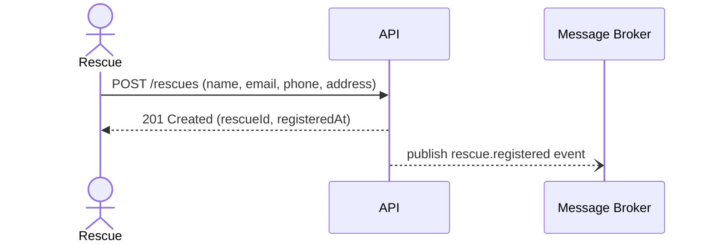
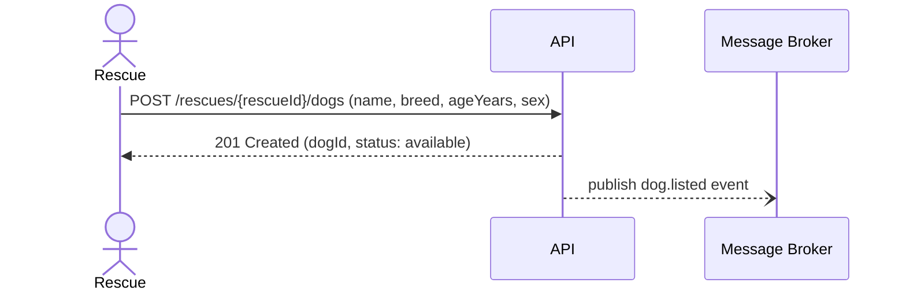
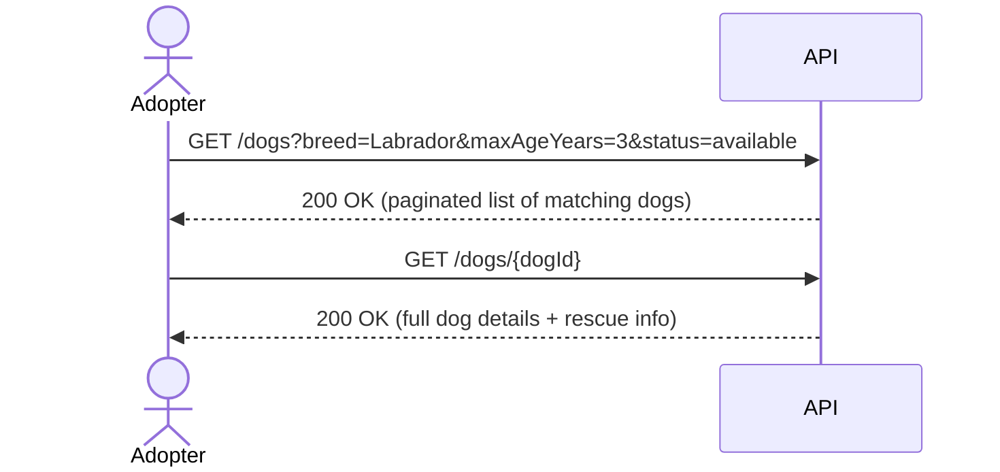
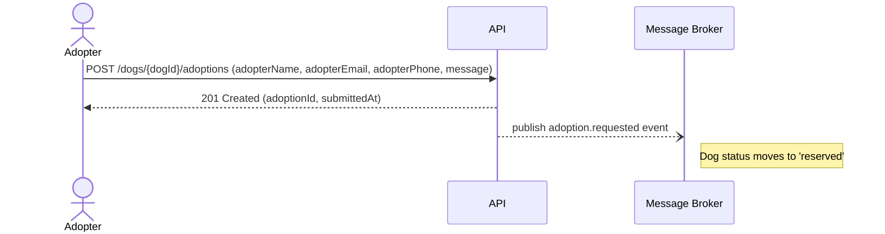
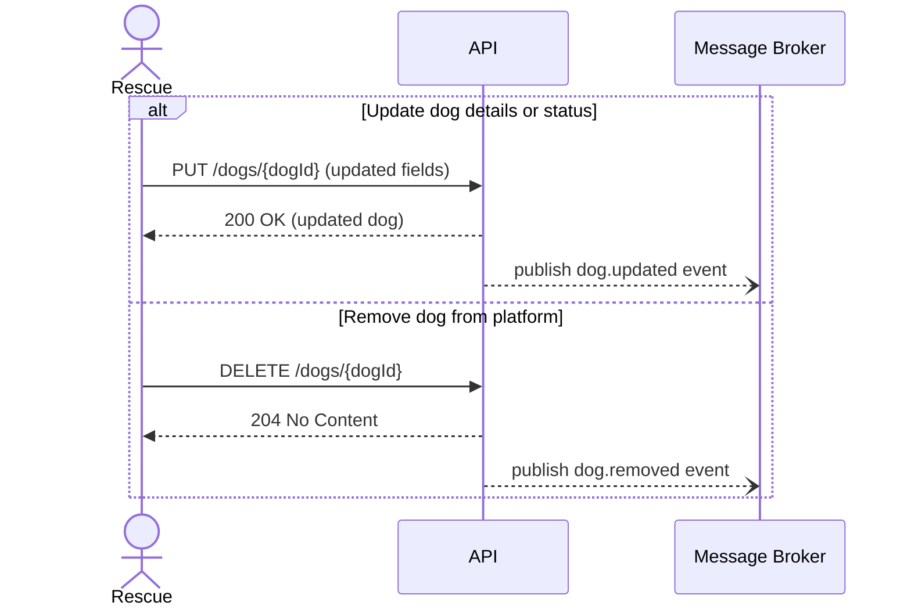

# Business Processes

This document describes the key end-to-end business processes of the Dog Rescue Adoption platform.
Each process is shown as a sequence diagram so you can understand the flow of interactions **before** reading the API or Events contracts.

## 1. Rescue Registration

A rescue organisation signs up to the platform so it can start listing dogs.

**Outcome:** The rescue receives a unique `rescueId` that it uses in all subsequent requests to add or manage its dogs.
A `rescue.registered` event is published so downstream systems (e.g. welcome emails, analytics) can react.

---

## 2. Dog Listing

A registered rescue adds a dog to the platform, making it discoverable by prospective adopters.

**Outcome:** The dog's status is set to `available` and it appears in cross-rescue browse results immediately.
A `dog.listed` event is published so search indexes and notification services stay up to date.

---

## 3. Adopter Browses and Finds a Dog

A prospective adopter uses the platform to search for a suitable dog across all rescues.

**Outcome:** The adopter identifies one or more dogs they are interested in and is ready to submit an adoption request.

---

## 4. Adoption Request Submission

The adopter submits an adoption request for a specific dog.

**Outcome:** The rescue is notified (via the `adoption.requested` event) and can review the request.
The dog's status transitions to `reserved`, preventing new adoption requests while the rescue decides.

---

## 5. Dog Update and Removal

A rescue can update a dog's details (e.g. correct breed, change status) or remove a dog that has left the platform.

**Outcome:** Changes are reflected in browse results immediately and downstream consumers are notified via the appropriate domain event.

---

## Summary

| Process | Actor | Key API Call | Domain Event |
|---------|-------|--------------|--------------|
| Rescue Registration | Rescue | `POST /rescues` | `rescue.registered` |
| Dog Listing | Rescue | `POST /rescues/{rescueId}/dogs` | `dog.listed` |
| Browse Dogs | Adopter | `GET /dogs` | — |
| Adoption Request | Adopter | `POST /dogs/{dogId}/adoptions` | `adoption.requested` |
| Update Dog | Rescue | `PUT /dogs/{dogId}` | `dog.updated` |
| Remove Dog | Rescue | `DELETE /dogs/{dogId}` | `dog.removed` |
