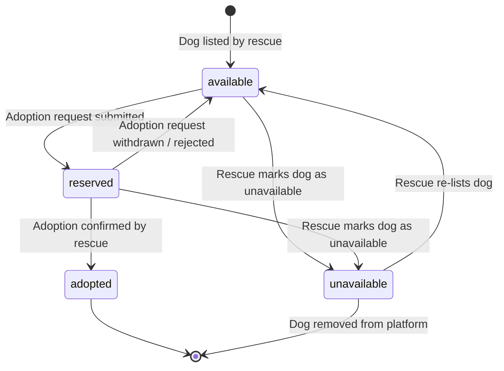
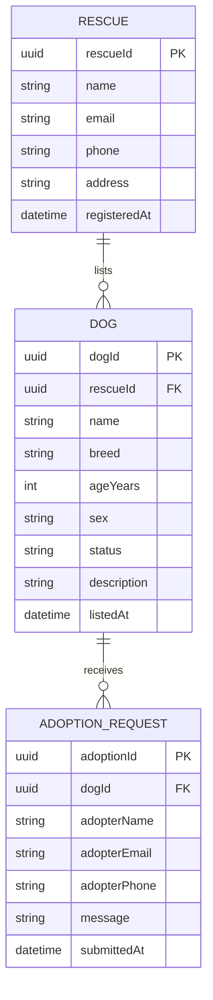

# Domain Model

This document describes the core entities of the Dog Rescue Adoption platform and the relationships between them.
It is intended to be read **before** the API and Events contracts, to provide the conceptual foundation for understanding what each endpoint and event represents.

## Entities

### Rescue Organisation

A **Rescue** is a registered animal rescue charity or individual that uses the platform to list dogs available for adoption.
Each rescue manages its own dogs independently and is identified by a unique `rescueId`.

| Field | Description |
|-------|-------------|
| `rescueId` | Unique identifier (UUID) |
| `name` | Name of the rescue organisation |
| `email` | Contact email address |
| `phone` | Contact phone number |
| `address` | Physical address of the rescue |
| `registeredAt` | ISO-8601 timestamp of when the rescue joined the platform |

### Dog

A **Dog** is an animal listed by a rescue as available for adoption.
Each dog is owned by exactly one rescue and moves through a defined set of adoption statuses over its lifetime on the platform.

| Field | Description |
|-------|-------------|
| `dogId` | Unique identifier (UUID) |
| `rescueId` | The rescue that listed this dog |
| `name` | Dog's name |
| `breed` | Breed (e.g. `Labrador`, `Greyhound`) |
| `ageYears` | Age in whole years |
| `sex` | `male` or `female` |
| `status` | Current adoption status (see [Dog Status](#dog-status)) |
| `description` | Optional free-text description of the dog |
| `listedAt` | ISO-8601 timestamp of when the dog was first listed |

#### Dog Status

A dog transitions through the following statuses:

| Status | Meaning |
|--------|---------|
| `available` | Dog is actively looking for a home and can receive adoption requests |
| `reserved` | An adoption request has been submitted; the rescue is reviewing it |
| `adopted` | The dog has been successfully rehomed |
| `unavailable` | The dog is temporarily not accepting adoption requests |

### Adoption Request

An **Adoption Request** is submitted by a prospective adopter expressing interest in a specific dog.
It captures the adopter's contact details and an optional message to the rescue.

| Field | Description |
|-------|-------------|
| `adoptionId` | Unique identifier (UUID) |
| `dogId` | The dog being applied for |
| `adopterName` | Full name of the prospective adopter |
| `adopterEmail` | Adopter's email address |
| `adopterPhone` | Adopter's phone number |
| `message` | Optional message to the rescue explaining why they want to adopt |
| `submittedAt` | ISO-8601 timestamp of when the request was submitted |

## Entity Relationships

- A **Rescue** lists zero or more **Dogs**.
- A **Dog** belongs to exactly one **Rescue** and can receive zero or more **Adoption Requests**.
- An **Adoption Request** is linked to exactly one **Dog**.
